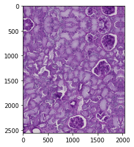
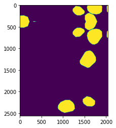
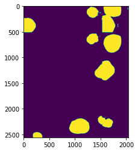
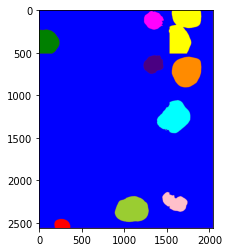

# Hubmap

Python Jupyter notebooks and .py files to identify kidney glomeruli [(hubmap NIH)](https://commonfund.nih.gov/hubmap)

Dice score of 96, with a loss <0.01.

## Example
#### Original image: 

#### Original mask:

#### Predicted mask:

#### Predicted mask (processed):

## License
[MIT](https://choosealicense.com/licenses/mit/)